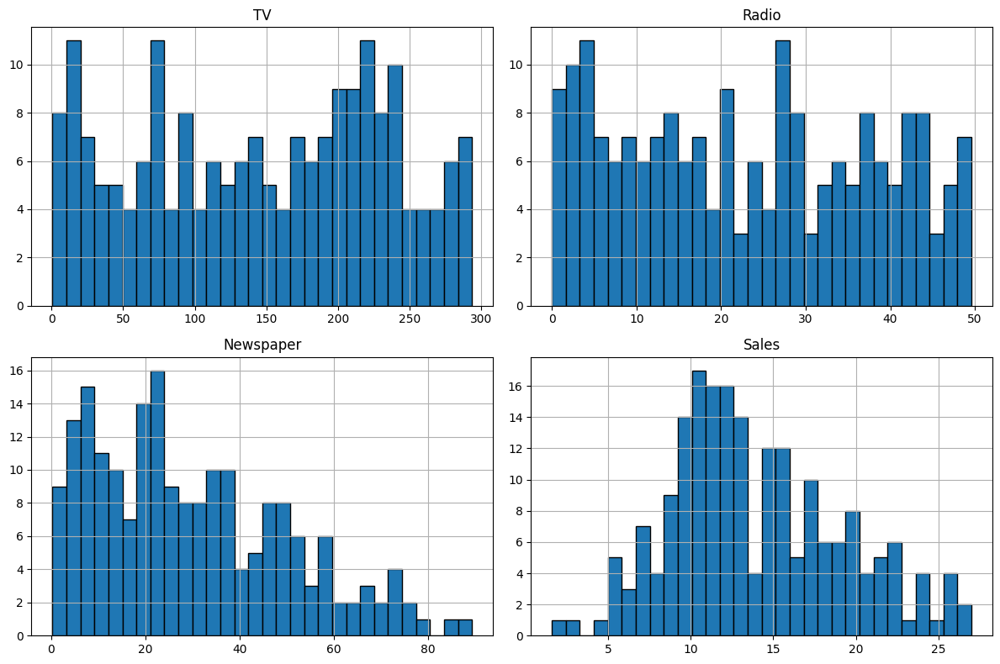
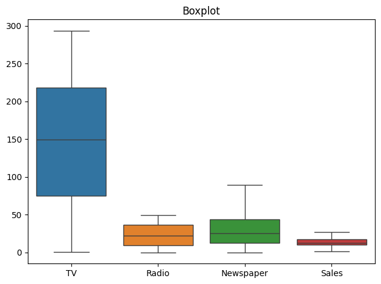
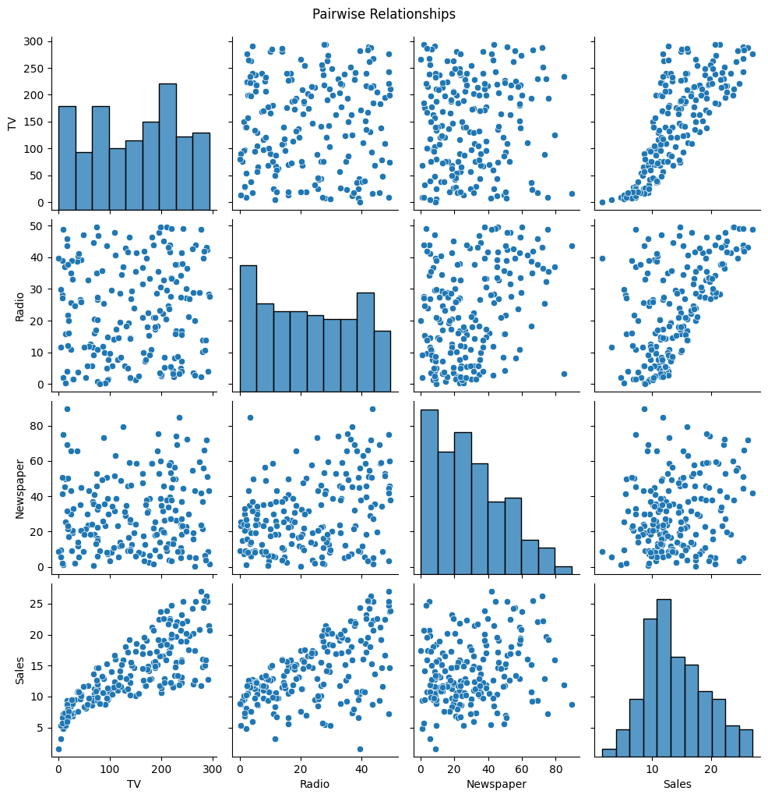
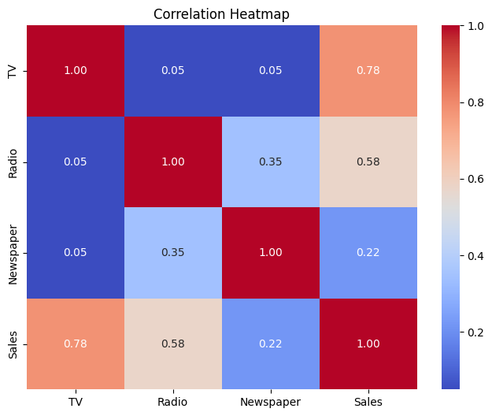
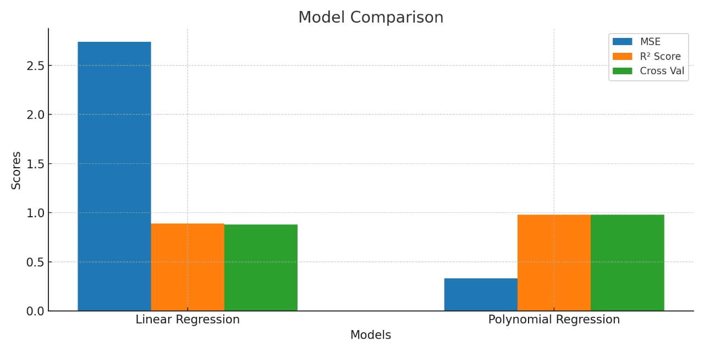
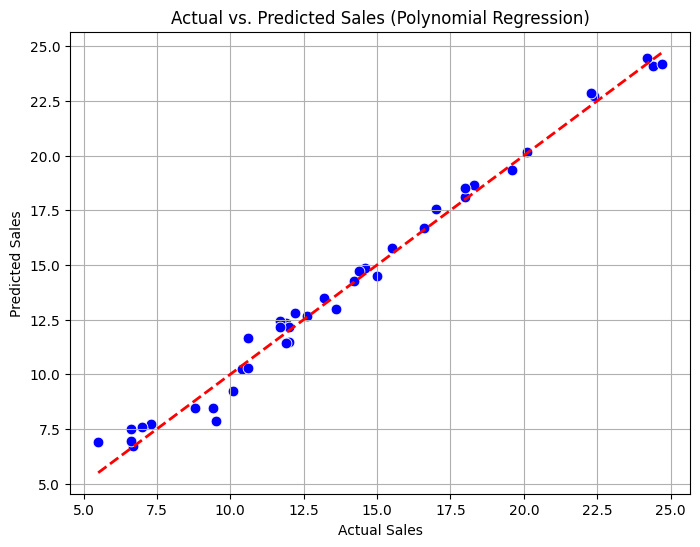

# advertising-sales-prediction
> Complete machine learning project using Linear and Polynomial Regression to predict product sales based on advertising spend. Includes EDA, model evaluation, and business insights.
# 📊 Polynomial Regression on Advertising Dataset

This repository demonstrates a complete pipeline from *Exploratory Data Analysis (EDA)* to building and evaluating both *Linear Regression* and *Polynomial Regression* models using the classic *Advertising dataset*.  
Perfect for anyone starting out in *Machine Learning* or *Data Science*. 🎯

---


---

## 📁 Project Structure

📦 Advertising-Regression-Project


┣ 📜 polynomial_regression.ipynb     # Main notebook


┣ 📊 data/ # Dataset (CSV file)


┣ 📷 images/ # Visualizations and outputs


┗ 📄 README.md                        # Project overview

---

## 🔰 Step-by-Step Breakdown

### 📌 Step 1: Load and Inspect Dataset
- Used pandas to load the Advertising dataset.
- Checked for null values, datatypes, and basic statistics.

### 📌 Step 2: Exploratory Data Analysis (EDA)
- Generated correlation matrix and pairplots using seaborn.
- Created boxplots to identify outliers.
#### 📷 Distribution of Data explained with Histogram  

#### 📷 Boxplot Screenshot  

#### 📷 Pair-wise Relationship  

#### 📷 Correlation Heatmap 


### 📌 Step 3: Feature Engineering
- No categorical encoding was needed.
- Created polynomial features using PolynomialFeatures for better curve fitting.

### 📌 Step 4: Train-Test Split
- Used train_test_split to divide the data into training and testing sets.

### 📌 Step 5: Linear Regression Model
- Fit a basic Linear Regression model.
- Evaluated using:
  - *Mean Squared Error (MSE)*
  - *R² Score*
  - *Cross-Validation Score*

### 📌 Step 6: Polynomial Regression Model
- Transformed features using PolynomialFeatures(degree=2).
- Trained and evaluated the model using the same metrics.

### 📌 Step 7: Model Evaluation
- Compared Linear and Polynomial Regression models using:
  - *R² Score*
  - *Mean Squared Error (MSE)*

#### 📷 Model Comparison Screenshot  


### 📌 Step 8: Visualization of Predictions
- Plotted *Actual vs Predicted Sales* to visualize the fit.

#### 📷 Actual vs Predicted Plot  


---

## 📈 Results Summary

✅ *Polynomial Regression* outperformed Linear Regression significantly, capturing the nonlinear patterns in the dataset more effectively.

---

## ✅ Conclusion

This project demonstrates:

- 🔹 Data cleaning and exploratory analysis  
- 🔹 Applying linear and polynomial regression  
- 🔹 Evaluating model performance both visually and statistically

It’s a great *starter project* for your *data science portfolio*.

---

## 📌 What's Next?

- 🔁 Add regularization (Ridge / Lasso)
- 🔍 Experiment with more features or datasets
- 🌐 Deploy using Streamlit or Flask

---

## 💻 Run It Yourself

### 1. Clone the repository

```bash
git clone https://github.com/Ferozshah-DS/Advertising-Regression-Project.git
cd Advertising-Regression-Project
```  
### 2. Open the Jupyter notebook

[](./polynomial_regression.ipynb) polynomial_regression.ipynb


---

## 🧠 Skills Demonstrated

📌 Data Cleaning & EDA

📌 Regression Modeling (Linear & Polynomial)

📌 Model Evaluation & Comparison

📌 Data Visualization with Matplotlib & Seaborn

📌 Python Libraries: Pandas, NumPy, Scikit-learn


---

## 📂 Dataset Source

📈 Advertising Dataset (ISLR)


---


## 📮 Connect with Me

### 🔗 LinkedIn
[Ferozshah-DS](https://www.linkedin.com/in/feroz-shah-1a3606359/)


### 🐙 GitHub
[Ferozshah-DS](https://github.com/Ferozshah-DS)


